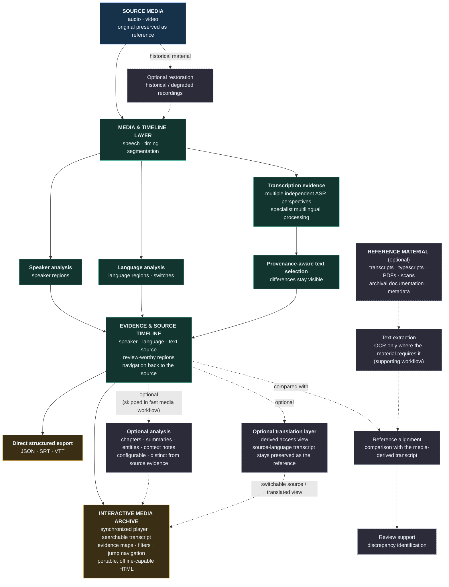

# R2 Mechanics – Public Architecture Diagram (2026)

Conceptual architecture of R2 Mechanics. The diagram shows layers and data flow, not the implementation. Orchestration logic, engine selection and decision rules are proprietary and not shown.

Source: this file (Mermaid, rendered by GitHub). Related: [System Overview](system_overview_en.md) · [Whitepaper](whitepaper_public_en.md) · [README](../README.md)

## Reading the diagram

- **Source first.** The original recording stays the temporal reference for everything downstream.
- **Evidence before interpretation.** Speaker, language and transcription-source information are mapped on one timeline before any optional analysis is added.
- **Optional analysis is a separate layer.** It can be configured for the purpose of the workflow and is not the source of the transcription.
- **Parallel outputs.** Structured exports and the interactive archive both come from the same evidence timeline. Neither is a prerequisite of the other.
- **Optional analysis feeds the archive.** Where a workflow asks for it, the analysis layer adds chapters, summaries and similar enrichment to the archive.
- **Translation is a derived layer.** The source-language transcript remains preserved as the reference. A translation adds a derived view that the archive can switch to, for research, access and multilingual navigation.
- **Reference material supports review.** Where a project has reference documents, text extracted from them (with OCR where required) can be compared with the media-derived transcript to support review and the identification of discrepancies. Original reference documents remain unchanged, and the media source stays the primary reference. It does not replace or rewrite the transcription of the source recording, and it is not used in every project.
- **Fast media workflow.** A fast media run skips the full editorial analysis, not the evidence timeline: player, transcript, navigation and the maps that are available stay usable.
